# Premium building editor review — 6 September 2026

The project has useful foundations: a compact editor shell, an architectural material palette, instanced façades, editable massing, separate edit drafts, and design-option snapshots. It does not yet offer the reliability or precision expected from a professional building editor. The highest-value investment is a dependable editing loop, followed by rendering stability, then visual refinement.

This is an assessment and implementation brief. Application source code was not changed.

## Evidence and limits

Reviewed the current local application at `http://127.0.0.1:5173/`, source code, installed Three.js implementation, existing tests, production build, and TypeScript checks. All screenshots below were captured and opened in this review. Earlier `design-qa.md` claims were treated as historical context, not current verification.

The in-app Browser was unavailable. With the user's permission, used local Playwright 1.57 / Chromium with ANGLE SwiftShader software rendering. This is useful for interaction and compatibility testing, but **does not establish hardware GPU frame rate or whether the black AO artifact also occurs on the user's normal browser**. No production simulations were submitted, and completed daylight/energy visualization, external services, touch input, screen readers, long-duration memory stability, and large projects remain unverified.

- Desktop: 1440 × 900, DPR 1; canvas 1440 × 852, starting 48 px below the navigation.
- Responsive normal workspace: 1024 × 768, 768 × 700, 640 × 700. Main overlay rectangles had zero measured overlap at all three sizes.
- Default sample: one 10 × 5 m footprint, six floors at 3.5 m, 300 m² GFA. Grid on; default sun control uses the current date at 14:00 and the Stockholm location default.
- Perspective camera position approximately `(40.371, 41.451, 40.371)`; near/far 0.1/1000.
- Four synchronous WebGL sample pixels returned four distinct opaque colors, including pure black. Nonblank verification alone is therefore insufficient.
- One instrumented composed frame: 56 draw calls, 38,725 submitted triangles, 404 lines, with the default model and context. These are aggregate rendering submissions, including passes, not unique model triangle counts or an FPS benchmark.
- No application console errors in the main interaction session. Initial separate capture emitted four SwiftShader ReadPixels stall warnings; those may be induced by capture.
- 21 test files / 107 tests passed. `npm run build` passed; largest JS chunk 1,143.09 kB, 313.57 kB gzip. Separate `tsc -p tsconfig.app.json --noEmit` reported **64 TypeScript errors**. Vite build currently does not run type checking.

Raw evidence: [runtime](runtime.json), [responsive measurements](responsive.json), [palette contrast](contrast.json), [type-check output](typecheck.txt), [initial console](initial-console.json), [delete/undo](delete-undo.json).

## Flow review

| Step | Flow | Health and finding |
|---|---|---|
| 1 | Open workspace | Impaired in the tested renderer: large black regions obscure the scene. Model framing is legible when rendering succeeds, but context dominates the background. |
| 2 | Select building | Works, but a large popup covers the selected model and adds an extra click before editing. Delete competes visually with Edit. |
| 3 | Open edit inspector | Controls and metrics are organized; the backdrop intercepts the entire viewport. |
| 4 | Preview seven floors, then click viewport | Preview mass height and GFA correctly become 24.5 m / 350 m². Clicking the viewport cancels editing and restores six floors / 21 m, preventing the advertised footprint interaction. |
| 5 | Open Save and run studies | Dialog opens, but saving and simulation are coupled; focus escapes to background controls and the field has no associated label. Actual simulations not run. |
| 6 | Open design history | Opens successfully. A single tiny node occupies a large empty modal; no detail is initially selected. History is not persisted across reload. |
| 7 | Enter footprint drawing | Settings and instructions appear, but precision entry, plan-first guidance, and an explicit completion action are missing. |
| 8 | Draw and close a four-vertex footprint | Succeeds with deliberate clicks: two buildings, about 497 m² total GFA. Rapid clicks at different locations can be misclassified as a double-click and terminate drawing. |
| 9 | Delete and attempt undo | Delete clears both buildings; the undo shortcut does not restore them. |

### 1. Workspace

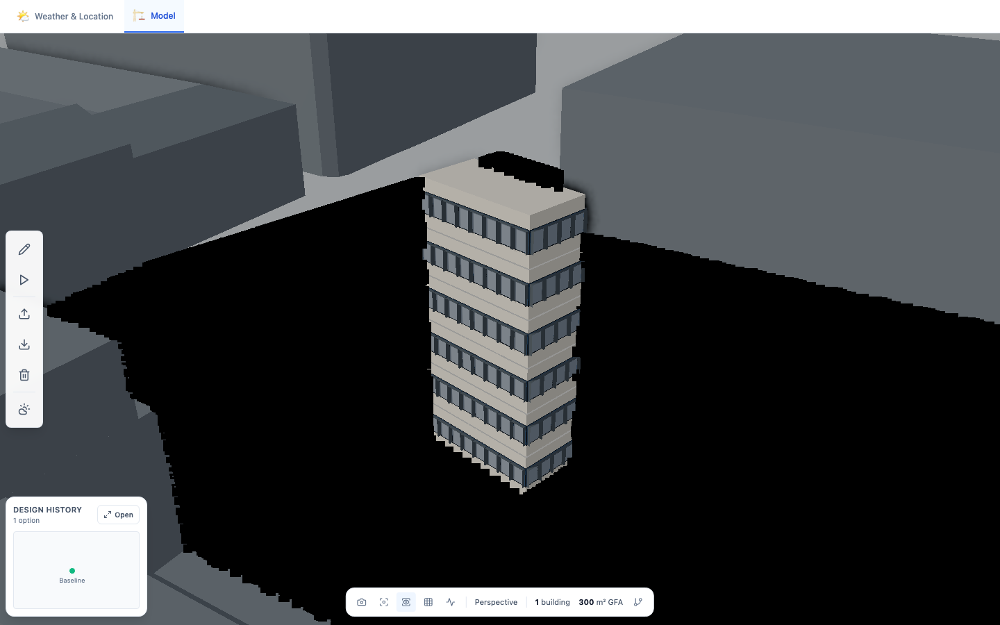

The normal pipeline produced black surfaces and intermittently obscured the active mass. This is a rendering compatibility/stability finding, not a recommendation to brighten the palette.

For diagnosis, temporarily disabling only SAO in the live test session restores the ground and building at the same camera. It was re-enabled afterward; no repository setting changed.

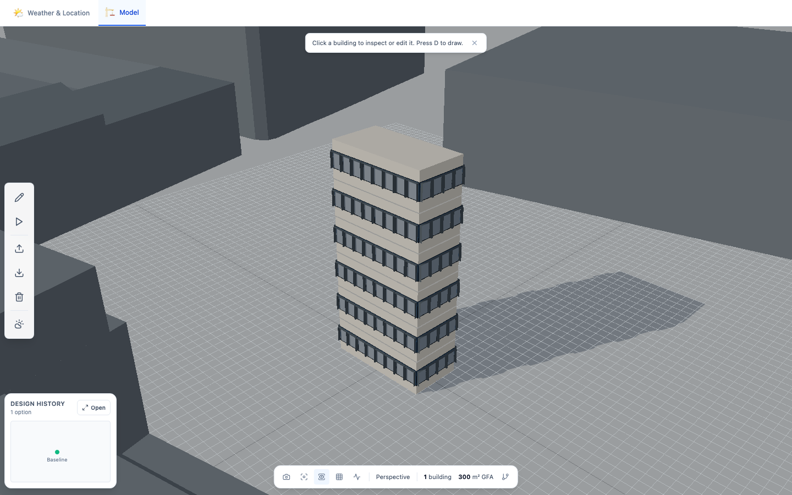

Even with SAO disabled, the grid is visually busy, façade edges are jagged, and close context blocks crowd the design. Preserve warm off-white massing and cool context, but introduce a quieter distance-fading grid, better edge filtering, and an explicit context visibility control.

### 2. Selection

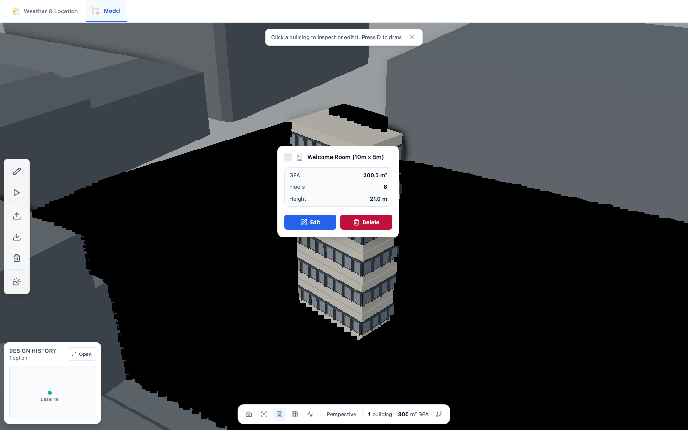

Select directly into a docked inspector. Keep hover feedback lightweight: name, floor count, and a small highlight. Move destructive actions to a quieter menu or inspector footer and support undo.

### 3–4. Edit and preview

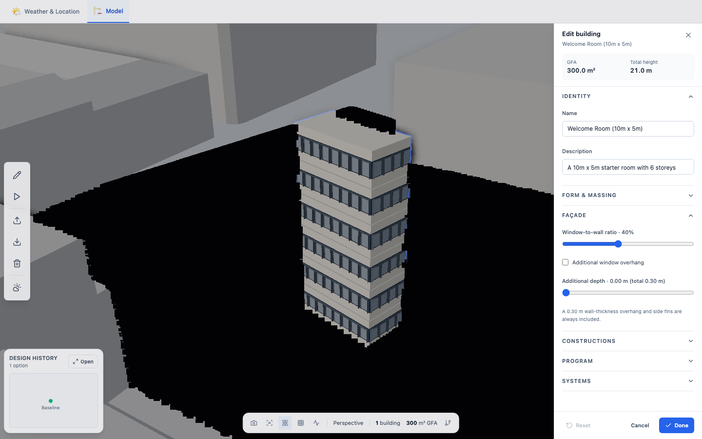

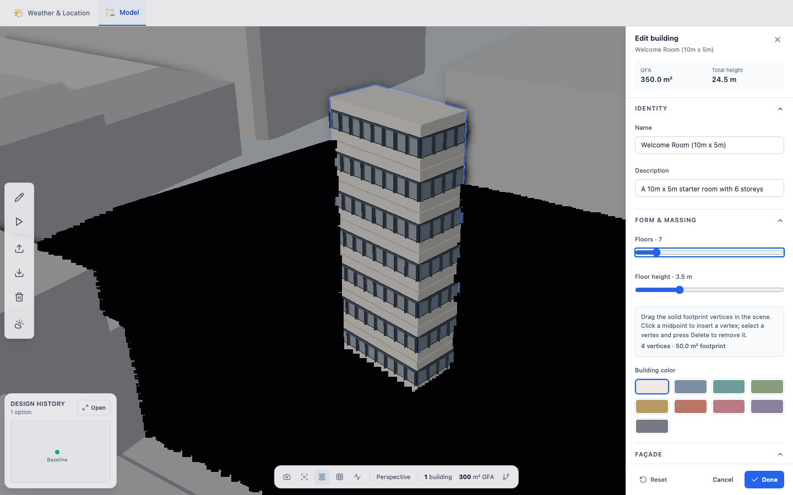

Keep the transactional draft mechanism: preview and cancel correctly restored height in the exercised case. Remove the viewport-blocking backdrop and make cancellation explicit. Open Form & Massing first for a building-design workflow; Identity can be secondary. Add numeric inputs alongside the floor, height, WWR, and shading sliders. Disable the extra-depth input when additional overhang is off, or clearly explain when its value takes effect.

### 5. Save/run

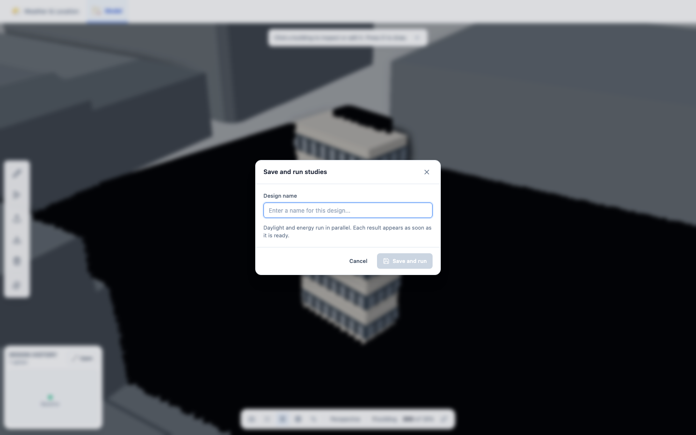

Provide a project Save/autosave state independently of a visible Run study action. Allow saving a design option without running energy and daylight. Show study setup, units, progress, and whether results match the current model revision.

Tabbing out of the input moved through Cancel, the document, Weather & Location, Model, and drawing tools. The overlay is not exposed as a dialog, and the visible Design name label is not associated with the input. Use a reusable accessible dialog with initial focus, focus containment, Escape, focus restoration, and semantic labeling. This follows the [WAI-ARIA modal dialog pattern](https://www.w3.org/WAI/ARIA/apg/patterns/dialog-modal/); it is not a claim of full accessibility conformance.

### 6. History

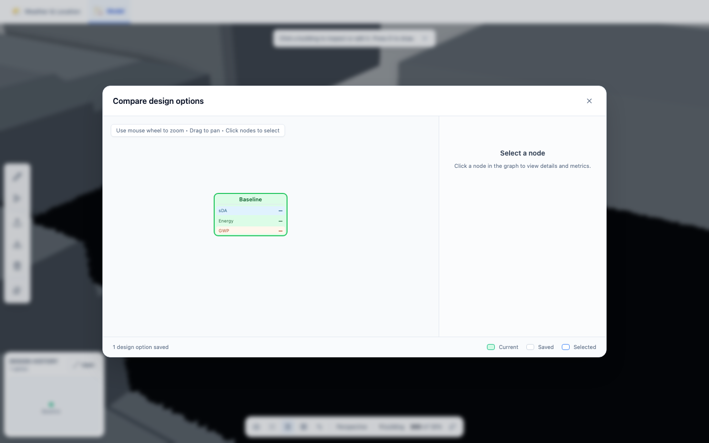

Automatically select the current option. Offer a readable comparison table or cards with thumbnails, option names, changes from baseline, metrics, units, and missing/pending/stale states. Retain the graph as an optional branching view. Collapse the always-visible mini graph into a compact history control when only one option exists. Make clear which work is saved durably.

### 7–8. Drawing

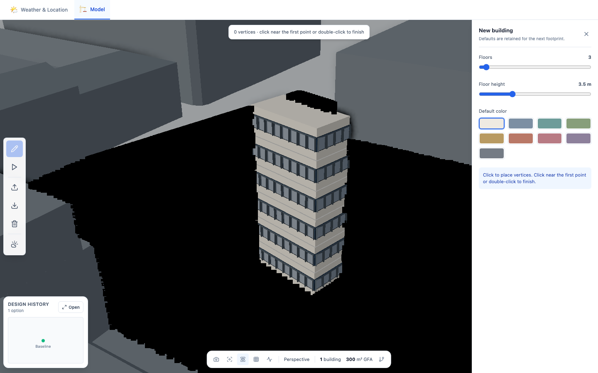

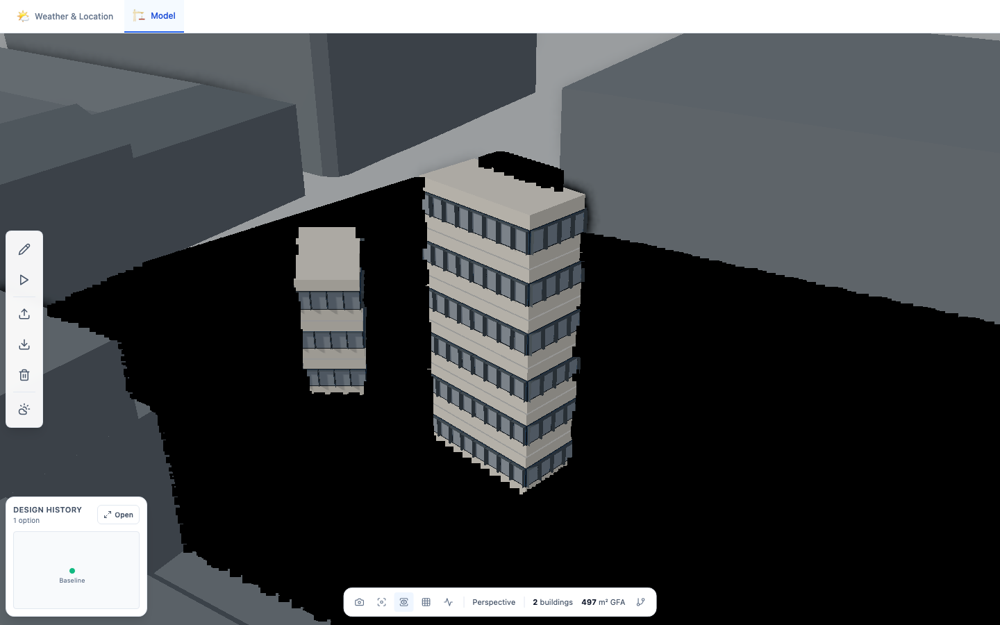

Add rectangle and polygon tools, optional automatic top view, typed edge lengths and angles, configurable snap increments, alignment guides, and an explicit Finish/Cancel strip. Keep perspective available for inspection. Existing rapid-click detection uses only a 300 ms interval, without checking spatial proximity; distinct fast vertex placements can finish the shape unintentionally. Use native double-click semantics or combined time/distance criteria, and validate before finishing.

### 9. Deletion

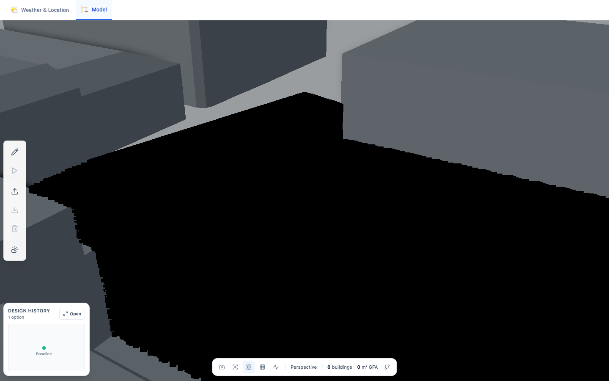

Scope Delete to the active selection. Put Clear workspace behind an explicit action. Every user edit, creation, deletion, and transform should enter a command history; one continuous drag should create one undoable command. Design-option snapshots are a separate feature from undo.

### Responsive normal workspace

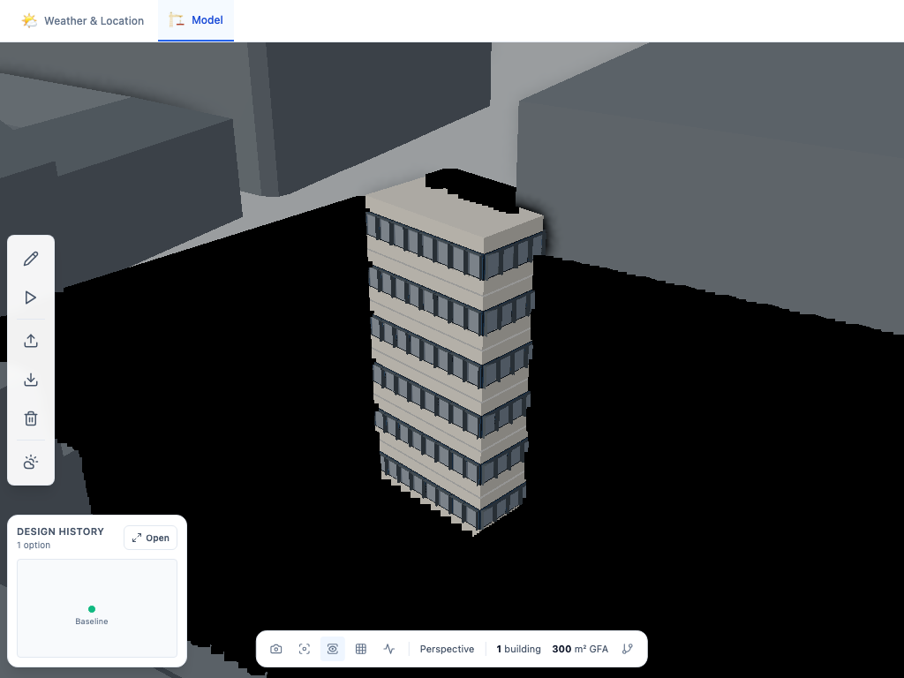

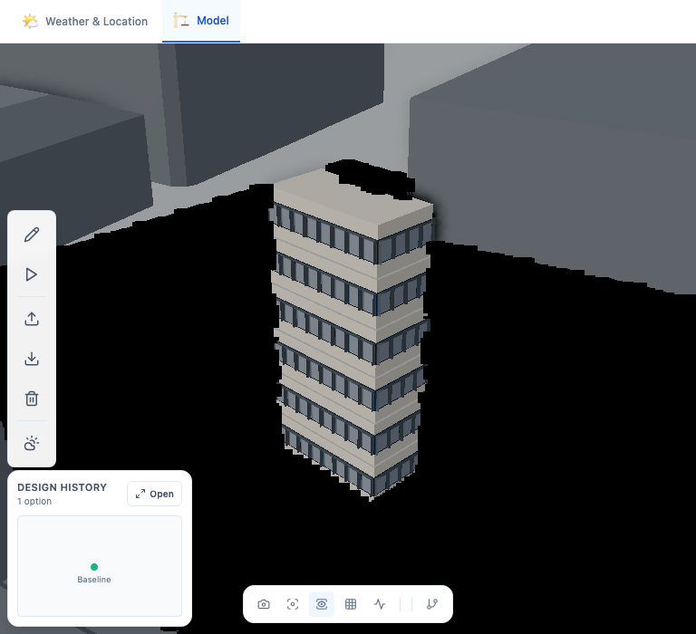

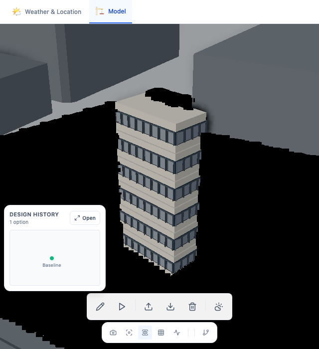

The primary overlays do not intersect at these sizes, which is a strength. At 640 px, the history card and two control rows still consume substantial model space. Collapse history by default, retain the active-tool name, and make narrow-screen editing a deliberate bottom-sheet experience. Normal layout checks do not establish that all dialogs, edit states, zoom levels, and touch targets work responsively.

## Engineering priorities

| Priority | Evidence | Proposed change | Acceptance |
|---|---|---|---|
| P0 | `BuildingEditPanel.tsx:73`: full-screen backdrop cancels editing and absorbs viewport input; reproduced live. | Nonmodal inspector; explicit Done/Cancel; retain orbit, pan, zoom and footprint handles. | Change floors, orbit, drag a vertex, commit/cancel. No accidental cancellation; all derived geometry and metrics agree. |
| P0 | `WindowService.ts:184`: instances updated without recomputing bounds. Live glass/frame/shade counts 144/576/432, all bounding-sphere radii **-1**. | Recompute valid bounds after changing matrices/counts, including creation/removal/reinstatement. | Every active instance lies inside its mesh bounds; no disappearing façades while orbiting, panning or reframing distant buildings. |
| P0 | SAO enabled produces black regions in SwiftShader; disabled resolves them at the same camera. | Isolate depth/normal/projection behavior, add GPU compatibility checks and a graceful AO-off quality fallback. | No black patches in fixed-camera captures and orbit videos on hardware and software paths; stable image after resize and camera changes. |
| P0 | `useKeyboardShortcuts.ts:85`, `SimpleBuildingCreator.tsx:840`: Delete clears the workspace. No general undo/redo; history service explicitly resets on reload. | Selection-scoped commands; undo/redo; project persistence, autosave and recoverable revisions. | Delete one selected building and undo it; recover the saved project and options after reload. |
| P1 | Default composer uses a render target with zero samples in installed Three.js; no AA pass. Jagged façade silhouettes visible. | Compare a supported multisampled target against SMAA at fixed DPR; choose one measured strategy with a safe fallback. | Clean roof, frame, grid, shade and selection edges in stills and motion at DPR 1 and 2. |
| P1 | `ThreeJSCore.ts:269` directly renders outside the composer; view changes asynchronously reinitialize it. | Route all output through RendererManager; update camera-dependent passes coherently; cancel stale initialization and dispose reliably. | Repeated rapid camera/view switches produce no lighting pop, stale projection, blank frame or growing render-target count. |
| P1 | `WindowService` rebuilds every building's façade on any update; mass and lines also recreate geometry; preview uses a trailing 50 ms debounce. | Dirty-building updates, stable instance ranges, reusable buffers, frame-coalesced previews, selective geometry invalidation. | Typing a name does not rebuild geometry; dragging updates continuously; unchanged buildings do not regenerate. |
| P1 | Continuous animation and auto-updating shadows, even while the model tab is hidden; performance toggle does not select a quality mode. | Demand rendering after controls settle; invalidate shadows only when required; pause hidden views; measured quality tiers. | Idle scene stops sustained rendering; active gestures stay responsive on named hardware; shadow changes remain correct. |
| P1 | Footprint validator is called only by edit UI; import accepts broad JSON shape and workspace replacement clears before rebuilding. | Shared model-boundary validation and staging before replacement. | Invalid/self-crossing/nonfinite/degenerate input gives actionable errors and preserves the previous workspace. |
| P1 | 64 TypeScript errors, including core, state and cleanup paths; Vite build omits type checking. | Dedicated typecheck in CI alongside tests and a small real-browser regression suite. | Typecheck, build, geometry invariants and key browser journeys pass on every release. |

Three.js requires updated spatial bounds when underlying instance data changes; see the [official update guidance](https://threejs.org/manual/en/how-to-update-things.html) and [InstancedMesh reference](https://threejs.org/docs/pages/InstancedMesh.html). Rendering into intermediate targets is distinct from rendering directly to the canvas; see [post-processing](https://threejs.org/manual/en/post-processing.html). The installed r160 source was also inspected, so these findings do not depend on assuming that current documentation matches the installed release in every detail.

## Proposed premium design direction

**A precise architectural workspace with a calm visual hierarchy.** The current white operational UI and warm/cool material separation are worth retaining.

- **Project bar:** project name, save status, Undo/Redo, Design/Analyze/Compare modes, and a labeled Run study button. Replace the mixed emoji navigation with the existing icon family.
- **Tools:** Select, Rectangle, Polygon, Move, Rotate, Measure. Offer command search and visible shortcut hints. Use F to frame selection; move the FPS counter into diagnostics.
- **Object list:** optional, searchable building list with rename, visibility, lock and isolate. This gives multi-building projects and keyboard users an alternative to canvas-only selection.
- **Inspector:** one persistent, resizable panel with Form, Façade, Program and Systems; numeric fields with units, optional sliders, inline validation, derived height/GFA, and visible draft state.
- **Canvas navigation:** view cube, north indicator, scale, Top/Front/Side shortcuts, fit selection/all, predictable orbit pivot and zoom. Fit into the unobscured canvas area when panels open. Derive fixed views from selection/project bounds rather than fixed world-origin framing.
- **Rendering:** crisp silhouettes; opaque clay walls; restrained glass; consistent corner and shade treatment; small contact shadows; quiet grid; context that can be subdued or hidden. Offer stable Studio lighting for editing and a clearly identified geographic Sun study mode.
- **Typography and density:** use 12–14 px for most operational labels, tabular numerals for dimensions, compact but comfortable controls, consistent radii/borders and less heavy floating shadow. Current 10–11 px text is often too small for sustained professional work.
- **Analysis:** dock results beside geometry, show units and thresholds, expose whether higher/lower is better, and mark results stale immediately after relevant edits. Legend toggles must restore material and selection state correctly.

Measured current CSS token ratios: ground/context 2.14:1, mass/glass 3.57:1, glass/frame 1.89:1. These measure material-role separation, not text WCAG compliance. The live glass token is `#547EA5`, which differs from the older QA document's `#607A92`; reconcile the documented and actual tokens after checking final shaded output.

## Definition of premium geometry

One validated model should drive mass, footprint handles, floor separators, façade layout, metrics and simulation export. Preserve the existing draft/commit and pure-snapshot direction.

Normalize winding and units; reject crossings, duplicate vertices, near-zero edges and nonfinite values before creating geometry. Define minimum edge/area tolerances relative to project scale. Retain sharp architectural corners and deliberate normals. Decide explicitly whether glazing is a diagrammatic overlay or a true opening: the current display places glass over solid mass surfaces, so transparency should not imply accurate interior views. Test corners, narrow walls, concave footprints, extreme WWR and shading depths. Prefer stable physical placement and depth conventions over accumulating arbitrary polygon offsets. Keep daylight/export geometry consistent with the chosen building model.

For every supported edit and import: mass height = floors × floor height; floor separators = floors − 1; façade count/layout agrees with the façade solver; cancel restores every layer; snapshots contain no live Three.js resources; failed input leaves the last valid model visible. Add property-based geometry cases and real-browser orbit/reinstate sequences beyond the existing happy-path tests.

## Delivery order and release gates

1. **Editing confidence:** unblock viewport editing, fix instance bounds, scope Delete, add undo/redo, and decouple durable saving from studies.
2. **Rendering correctness:** resolve AO compatibility, add effective edge filtering, unify frame output, stabilize camera/shadow updates, and test disposal/recovery.
3. **Professional workflow:** numeric inputs, snapping, plan tools, object list, accessible dialogs, and clear Design/Analyze/Compare navigation.
4. **Visual polish and scale:** calibrate materials/light/grid, reduce UI clutter, optimize dirty updates and idle rendering, then benchmark larger sites.

Proposed performance targets, not measured results: p95 frame time ≤16.7 ms on an agreed reference laptop for a representative scene; ≤33.3 ms in a reduced-quality fallback; lightweight input feedback within one frame and geometry preview within 50 ms; no sustained rendering while settled and hidden. Benchmark 1, 20 and 100 buildings, high-window cases, concave footprints and analysis overlays at fixed viewport/DPR. Record hardware, p50/p95 frame time, long tasks, all-pass draw calls and geometry/texture counts. Do not use SwiftShader FPS as a user-laptop benchmark.

Require 100 edit/cancel/delete/reinstate cycles with bounded resources after warm-up; repeated orthographic/perspective switches; desktop and narrow-window screenshots; short slow-orbit captures for shimmer and z-fighting; keyboard completion of dialogs; and reload recovery of saved work. Keep external analysis checks separate so engine outages are distinguishable from editor defects.
